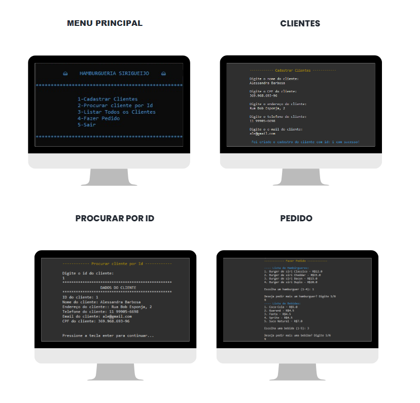
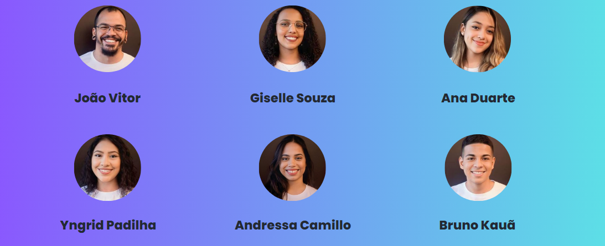

## 📝 Sobre o projeto:
<p>Projeto em Java construído durante o Bootcamp Desenvolvedor Java Fullstack da Generation Brasil, pelos alunos que uniram seus conhecimentos propondo um projeto para facilitar o sistema de pedidos delivery para uma hamburgueria artesanal. </p>

## 🛠 Tecnologias:

As seguintes ferramentas foram usadas na construção do projeto:


## 💬 Assuntos abordados:
- Laços condicionais
- Estruturas de repetição
- Array List
- Collections
- Programação Orientada a Objetos


## 🖼️Apresentação do projeto:

<p align="center">
<a href="https://www.canva.com/design/DAFemQk-YEM/-nJFPNz5QgxSY6hYDymVYA/view?utm_content=DAFemQk-YEM&utm_campaign=designshare&utm_medium=link&utm_source=homepage_design_menu#4">Slides da apresentação do projeto</a> ♥ 
</p>

<br>

## ▶️ Rodar a aplicação no console:
```bash
# Clone este repositório
$ git clone https://github.com/gisellesouzaa/projeto_java.git
```


## 💻 Aplicação:
<p>Foto do console com as principais funcionalidades da aplicação</p>


<br>

## 👩🏽‍💻 Desenvolvedores:

